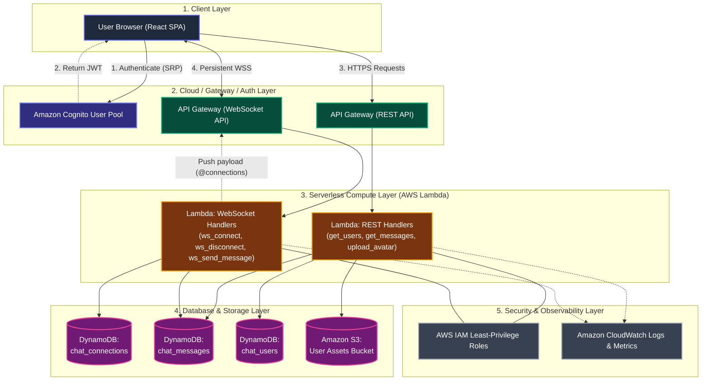

# System Architecture Diagram
### Serverless Communication Through Real-Time Chat

```
======================================================================================================================
                                              1. CLIENT LAYER
======================================================================================================================
                                         [ Web Browser / End User ]
                                                     |
                                   +-----------------+-----------------+
                                   |  React Single Page Application    |
                                   |  - Amazon Cognito Auth SDK        |
                                   |  - Native WebSocket (WSS) Client  |
                                   |  - REST API Client                |
                                   +-----------------+-----------------+
                                                     |
                                         HTTPS (443) | WSS (443)
                                                     |
======================================================================================================================
                                        2. CLOUD GATEWAY & AUTH LAYER
======================================================================================================================
         +-------------------------------------------+-------------------------------------------+
         |                                           |                                           |
+--------v--------+                        +---------v---------+                       +---------v---------+
| Amazon Cognito  |                        |   API Gateway     |                       |   API Gateway     |
|   User Pool     |                        |    (REST API)     |                       |  (WebSocket API)  |
| - SRP Auth      |                        | - GET /users      |                       | - $connect        |
| - JWT Issuance  |                        | - GET /messages   |                       | - $disconnect     |
| - Identity Pool |                        | - POST /avatar-url|                       | - sendMessage     |
+-----------------+                        +---------+---------+                       +---------+---------+
                                                     |                                           |
======================================================================================================================
                                           3. COMPUTE LAYER (FaaS)
======================================================================================================================
                                                     |                                           |
                                      +--------------v-------------------------------------------v--------------+
                                      |                                AWS Lambda                               |
                                      |                 (Python 3.11 Runtime / Stateless Workers)               |
                                      |                                                                         |
                                      |  [rest_get_users]      [ws_connect]         [ws_send_message]           |
                                      |  [rest_get_messages]   [ws_disconnect]      [ws_default]                |
                                      |  [rest_upload_avatar]                                                   |
                                      +-------------------------------------+-----------------------------------+
                                                                            |
======================================================================================================================
                                       4. DATABASE & STORAGE LAYER
======================================================================================================================
                                         +----------------------------------+----------------------------------+
                                         |                                  |                                  |
                              +----------v----------+            +----------v----------+            +----------v----------+
                              |   Amazon DynamoDB   |            |   Amazon DynamoDB   |            |      Amazon S3      |
                              |  (chat_connections) |            |   (chat_messages)   |            |  (User Assets Bucket|
                              | - PK: connectionId  |            | - PK: conversationId|            | - Avatars           |
                              | - GSI: UserIdIndex  |            | - SK: timestamp#UUID|            | - Pre-signed PUTs   |
                              +---------------------+            +---------------------+            +---------------------+
                                         |                                  |                                  |
======================================================================================================================
                                     5. SECURITY & OBSERVABILITY LAYER
======================================================================================================================
         +----------------------------------------------------------+-------------------------------------------------+
         |                          AWS IAM                         |                Amazon CloudWatch                |
         | - Least-privilege function execution roles               | - Centralized logs (/aws/lambda/*)              |
         | - Resource-level ARNs & SigV4 encryption                 | - Real-time metrics & error telemetry           |
         +----------------------------------------------------------+-------------------------------------------------+
```

---

## Interactive Mermaid Diagram


